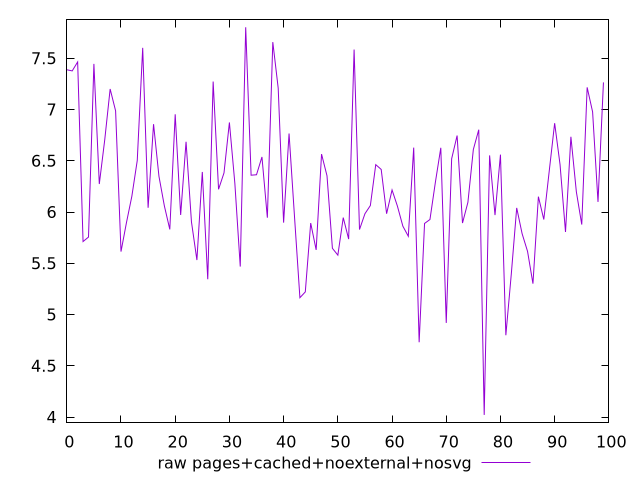

# Report pages+cached+noexternal+nosvg

[parent..](./..)  


## Scores

  

## Score Histogram

  

## Score Indicators

```yaml
{}

```

## Raw Values

  

## Raw Values Histogram

  

## Raw Indicators

```yaml
min: 4.0211
max: 7.8036
range: 3.7825000000000006
mean: 6.247095000000002
median: 6.176399999999999
stdev: 0.6818047682988145
skewness: -0.07305398332947594

```

<style>
  img {
    max-width: 80%;
  }
</style>
      
