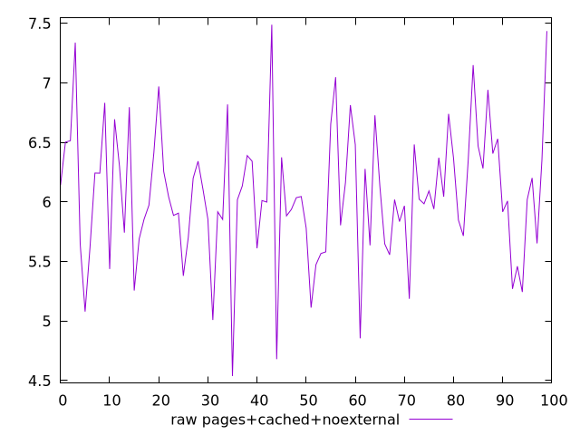
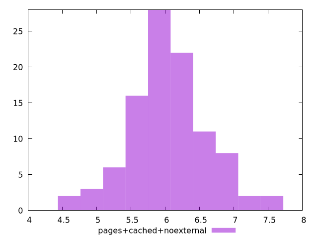

# Report pages+cached+noexternal

[parent..](./..)  


## Scores

  

## Score Histogram

  

## Score Indicators

```yaml
{}

```

## Raw Values

  

## Raw Values Histogram

  

## Raw Indicators

```yaml
min: 4.5383000000000004
max: 7.488499999999999
range: 2.950199999999999
mean: 6.056601
median: 6.0214
stdev: 0.561075167423225
skewness: 0.007268460008180319

```

<style>
  img {
    max-width: 80%;
  }
</style>
      
