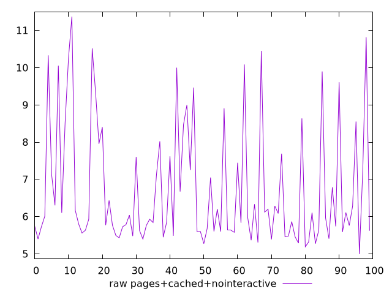
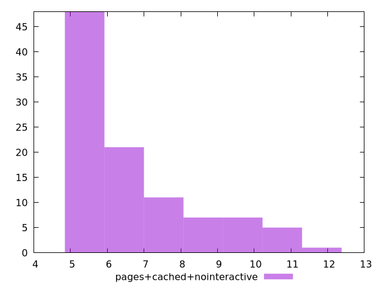

# Report pages+cached+nointeractive

[parent..](./..)  


## Scores

  

## Score Histogram

  

## Score Indicators

```yaml
{}

```

## Raw Values

  

## Raw Values Histogram

  

## Raw Indicators

```yaml
min: 4.991499999999999
max: 11.367400000000002
range: 6.375900000000002
mean: 6.716600116641937
median: 5.9464999999999995
stdev: 1.6278902789575513
skewness: 1.268746898403664

```

<style>
  img {
    max-width: 80%;
  }
</style>
      
