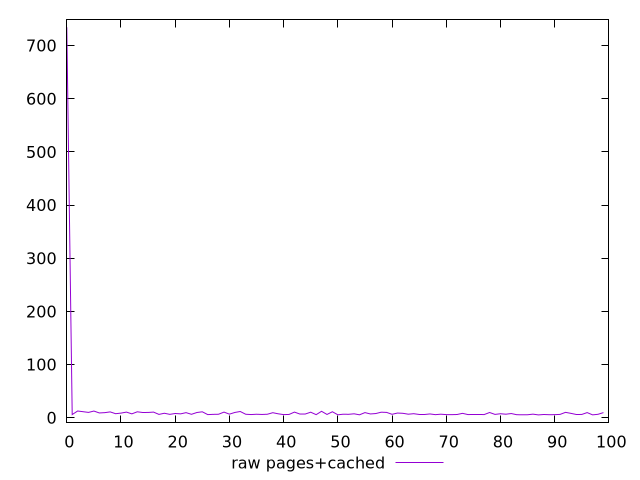

# Report pages+cached

[parent..](./..)  


## Scores

  

## Score Histogram

  

## Score Indicators

```yaml
{}

```

## Raw Values

  

## Raw Values Histogram

  

## Raw Indicators

```yaml
min: 5.343299999999999
max: 734.474
range: 729.1307
mean: 15.049989387752102
median: 6.966800000000001
stdev: 72.3317455623014
skewness: 9.838171675168295

```

<style>
  img {
    max-width: 80%;
  }
</style>
      
