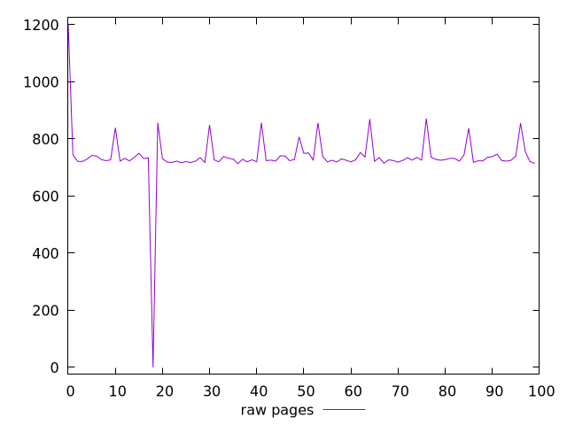
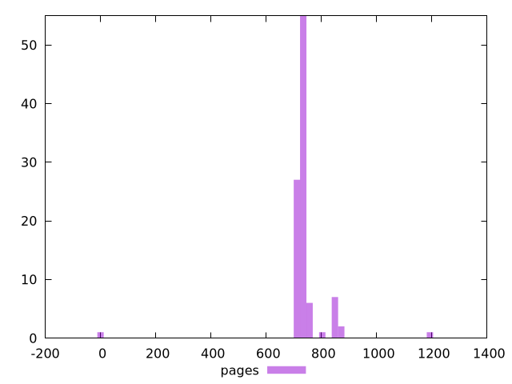

# Report pages

[parent..](./..)  


## Scores

  

## Score Histogram

  

## Score Indicators

```yaml
{}

```

## Raw Values

  

## Raw Values Histogram

  

## Raw Indicators

```yaml
min: 0
max: 1202.09
range: 1202.09
mean: 738.3022
median: 727.2415
stdev: 95.06869969890195
skewness: -3.351958368426438

```

<style>
  img {
    max-width: 80%;
  }
</style>
      
