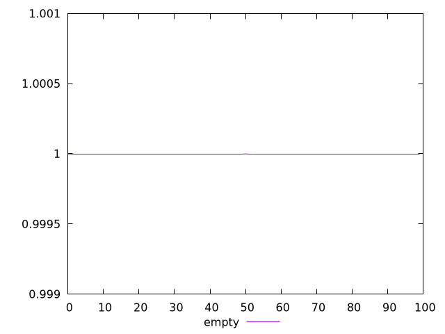
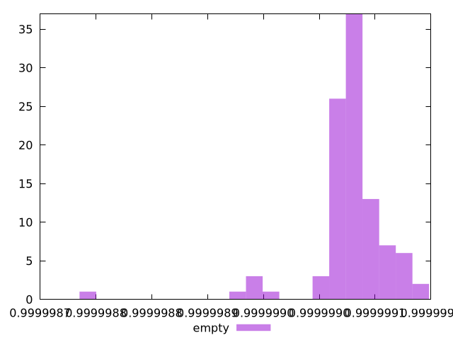

# Report empty

[parent..](./..)  


## Scores

  

## Score Histogram

  

## Score Indicators

```yaml
min: 0.999998788254921
max: 0.999999083932518
range: 2.9567759707305186e-7
mean: 0.999999029466277
median: 0.9999990336225066
stdev: 3.708579136246379e-8
skewness: -3.0717507037416967

```

## Raw Values

  

## Raw Values Histogram

  

## Raw Indicators

```yaml
{}

```

<style>
  img {
    max-width: 80%;
  }
</style>
      
