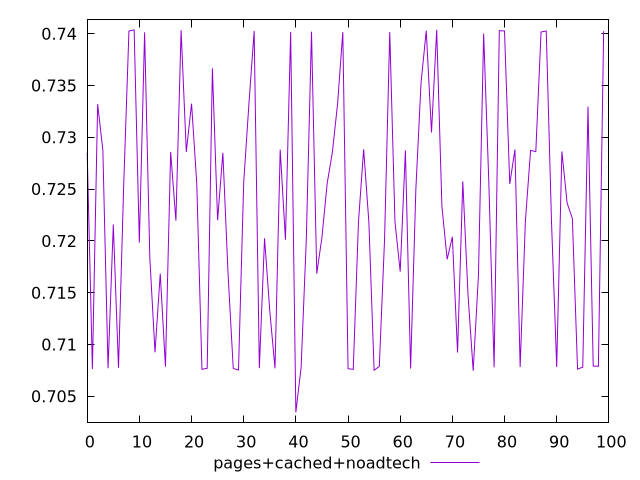
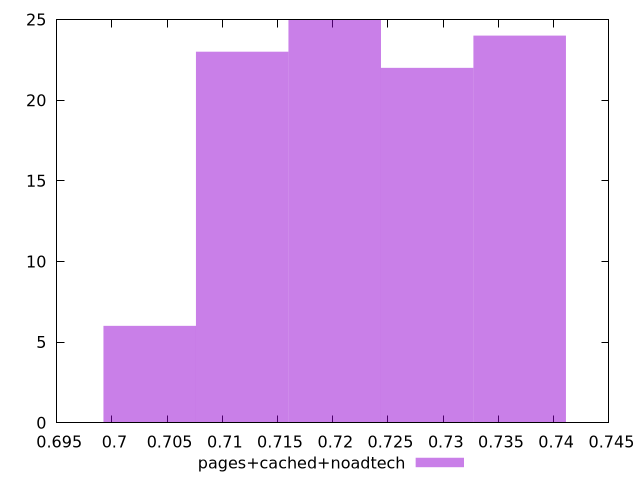

# Report pages+cached+noadtech

[parent..](./..)  


## Scores

  

## Score Histogram

  

## Score Indicators

```yaml
min: 0.7034513574963634
max: 0.7403740401103269
range: 0.036922682613963476
mean: 0.722701275050524
median: 0.7219918287033769
stdev: 0.011512483220596935
skewness: 0.0658083668565675

```

## Raw Values

  

## Raw Values Histogram

  

## Raw Indicators

```yaml
{}

```

<style>
  img {
    max-width: 80%;
  }
</style>
      
