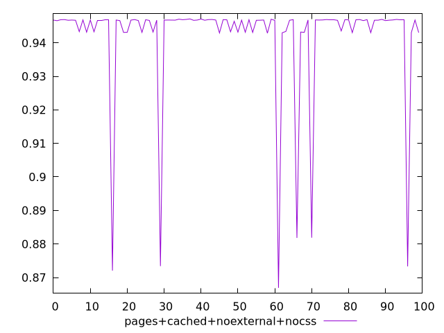
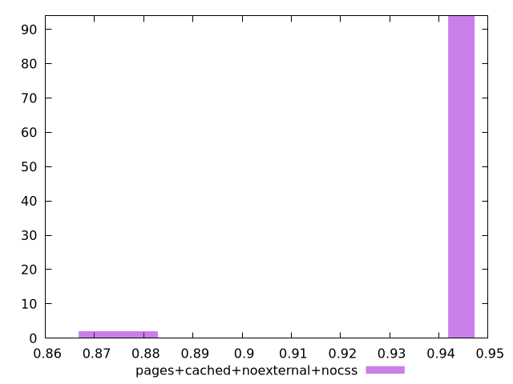

# Report pages+cached+noexternal+nocss

[parent..](./..)  


## Scores

  

## Score Histogram

  

## Score Indicators

```yaml
min: 0.8669168461172694
max: 0.9471142362786429
range: 0.0801973901613735
mean: 0.9416768317962295
median: 0.9467421192321188
stdev: 0.016991682295258513
skewness: -3.69385125713456

```

## Raw Values

  

## Raw Values Histogram

  

## Raw Indicators

```yaml
{}

```

<style>
  img {
    max-width: 80%;
  }
</style>
      
