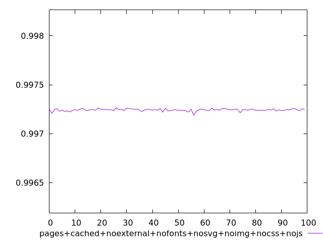
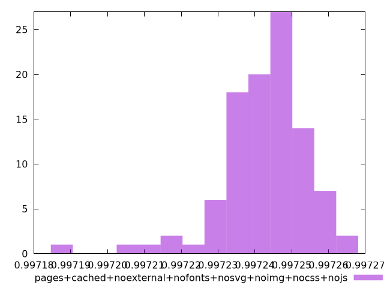

# Report pages+cached+noexternal+nofonts+nosvg+noimg+nocss+nojs

[parent..](./..)  


## Scores

  

## Score Histogram

  

## Score Indicators

```yaml
min: 0.9971889864051449
max: 0.9972645650337674
range: 0.00007557862862250797
mean: 0.9972425688122466
median: 0.9972440532632781
stdev: 0.000011458682020037786
skewness: -1.3413001932289756

```

## Raw Values

  

## Raw Values Histogram

  

## Raw Indicators

```yaml
{}

```

<style>
  img {
    max-width: 80%;
  }
</style>
      
