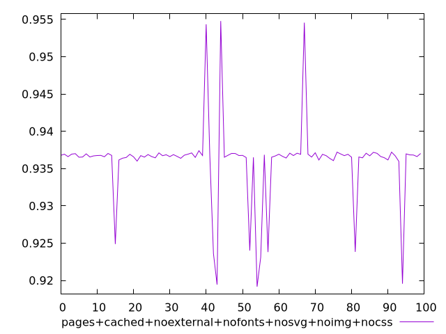
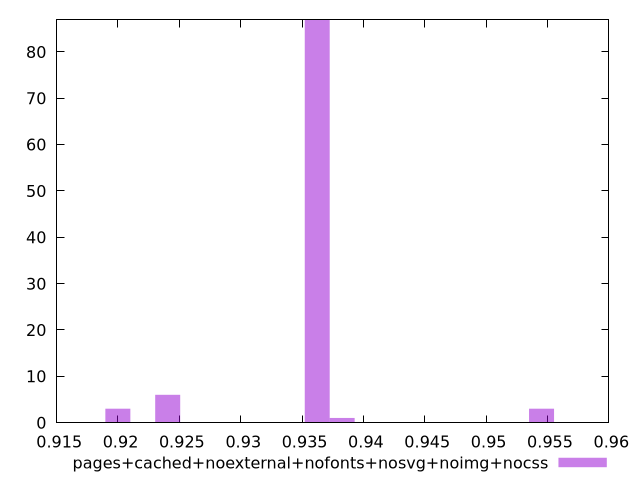

# Report pages+cached+noexternal+nofonts+nosvg+noimg+nocss

[parent..](./..)  


## Scores

  

## Score Histogram

  

## Score Indicators

```yaml
min: 0.9191729000643473
max: 0.954788993210247
range: 0.03561609314589975
mean: 0.9359724532336594
median: 0.9367340218010968
stdev: 0.005291310656950894
skewness: -0.33829319453819623

```

## Raw Values

  

## Raw Values Histogram

  

## Raw Indicators

```yaml
{}

```

<style>
  img {
    max-width: 80%;
  }
</style>
      
