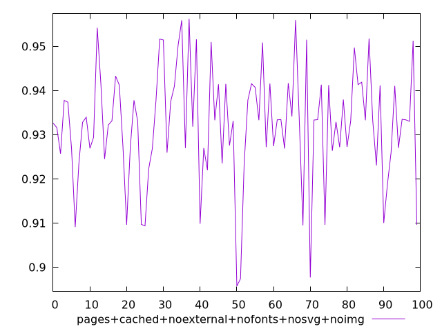
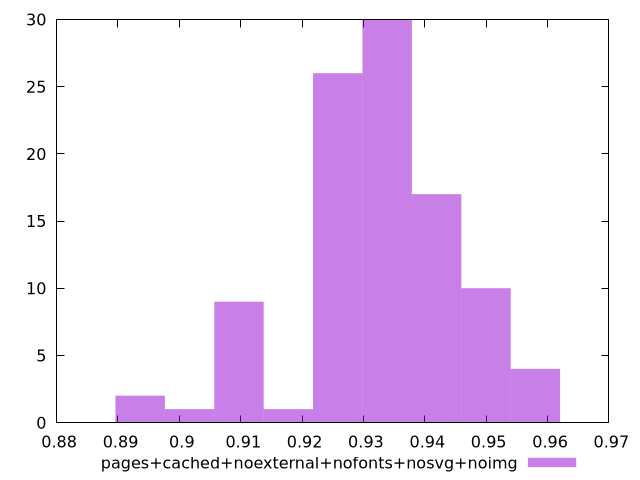

# Report pages+cached+noexternal+nofonts+nosvg+noimg

[parent..](./..)  


## Scores

  

## Score Histogram

  

## Score Indicators

```yaml
min: 0.8957214736941205
max: 0.956249312693343
range: 0.06052783899922254
mean: 0.9322628890910056
median: 0.9331950451091717
stdev: 0.013039236632637086
skewness: -0.5251003544364794

```

## Raw Values

  

## Raw Values Histogram

  

## Raw Indicators

```yaml
{}

```

<style>
  img {
    max-width: 80%;
  }
</style>
      
