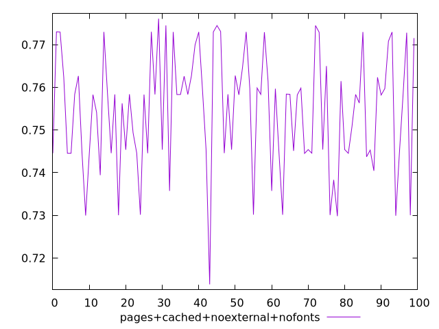
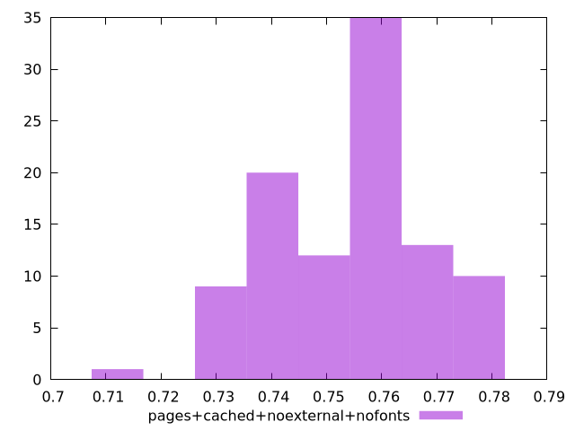

# Report pages+cached+noexternal+nofonts

[parent..](./..)  


## Scores

  

## Score Histogram

  

## Score Indicators

```yaml
min: 0.7138201895039116
max: 0.7761036445792794
range: 0.06228345507536781
mean: 0.7544502888195594
median: 0.758317177176483
stdev: 0.013828577242938766
skewness: -0.3726806570110021

```

## Raw Values

  

## Raw Values Histogram

  

## Raw Indicators

```yaml
{}

```

<style>
  img {
    max-width: 80%;
  }
</style>
      
