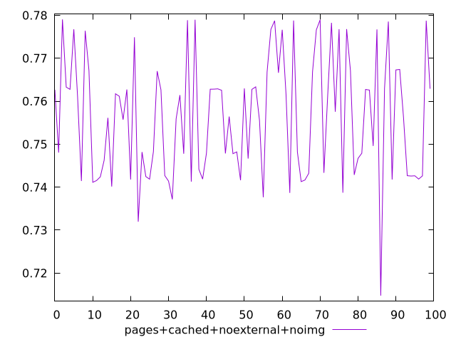
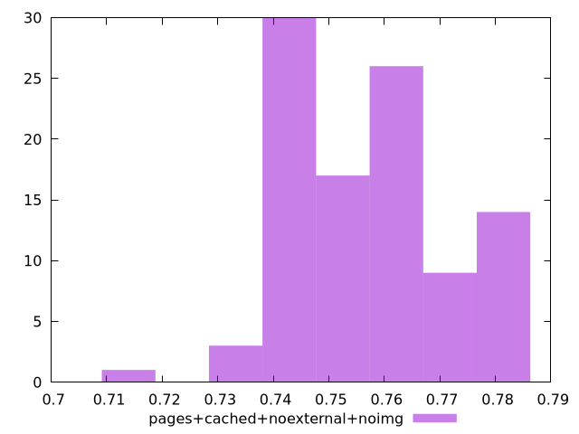

# Report pages+cached+noexternal+noimg

[parent..](./..)  


## Scores

  

## Score Histogram

  

## Score Indicators

```yaml
min: 0.7147547392845612
max: 0.7790537125520788
range: 0.06429897326751755
mean: 0.7562201912830423
median: 0.7563652823548214
stdev: 0.014041706958285103
skewness: 0.017197655884874014

```

## Raw Values

  

## Raw Values Histogram

  

## Raw Indicators

```yaml
{}

```

<style>
  img {
    max-width: 80%;
  }
</style>
      
