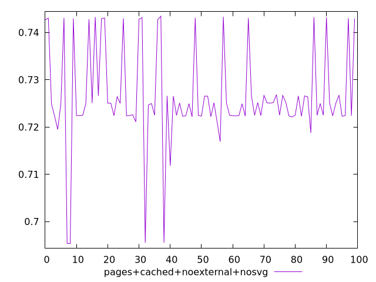
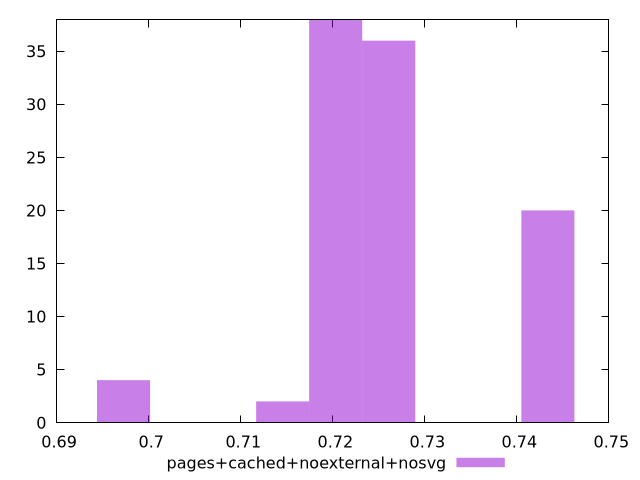

# Report pages+cached+noexternal+nosvg

[parent..](./..)  


## Scores

  

## Score Histogram

  

## Score Indicators

```yaml
min: 0.6953394544371808
max: 0.7434434166176186
range: 0.048103962180437776
mean: 0.7263552836139049
median: 0.7249703374953986
stdev: 0.010212772796726565
skewness: -0.3048684945799428

```

## Raw Values

  

## Raw Values Histogram

  

## Raw Indicators

```yaml
{}

```

<style>
  img {
    max-width: 80%;
  }
</style>
      
