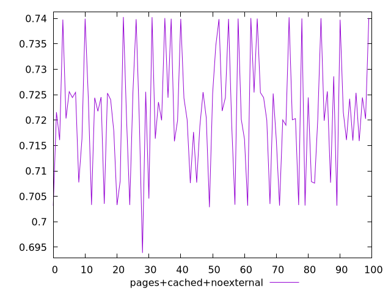
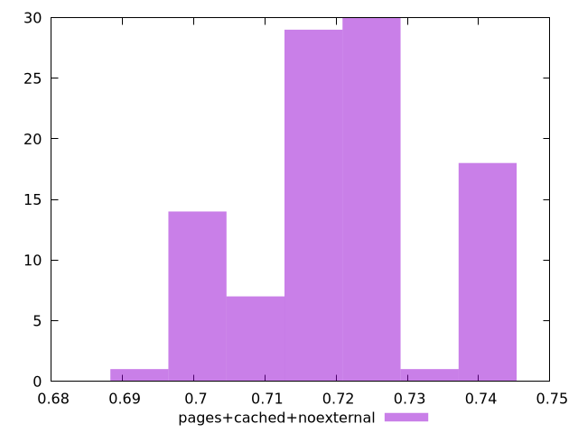

# Report pages+cached+noexternal

[parent..](./..)  


## Scores

  

## Score Histogram

  

## Score Indicators

```yaml
min: 0.6938788094341487
max: 0.7402875067534762
range: 0.04640869731932751
mean: 0.721248480221767
median: 0.7203971196843859
stdev: 0.011707937616242106
skewness: 0.0203556600487209

```

## Raw Values

  

## Raw Values Histogram

  

## Raw Indicators

```yaml
{}

```

<style>
  img {
    max-width: 80%;
  }
</style>
      
