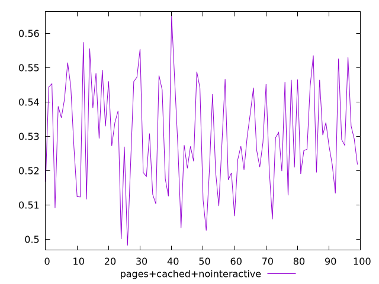
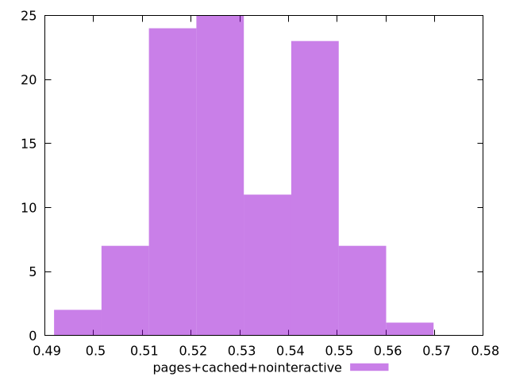

# Report pages+cached+nointeractive

[parent..](./..)  


## Scores

  

## Score Histogram

  

## Score Indicators

```yaml
min: 0.4981973987692562
max: 0.5650438794600615
range: 0.06684648069080534
mean: 0.530016354259184
median: 0.5278214242178506
stdev: 0.014791226611591414
skewness: 0.06723117523004968

```

## Raw Values

  

## Raw Values Histogram

  

## Raw Indicators

```yaml
{}

```

<style>
  img {
    max-width: 80%;
  }
</style>
      
