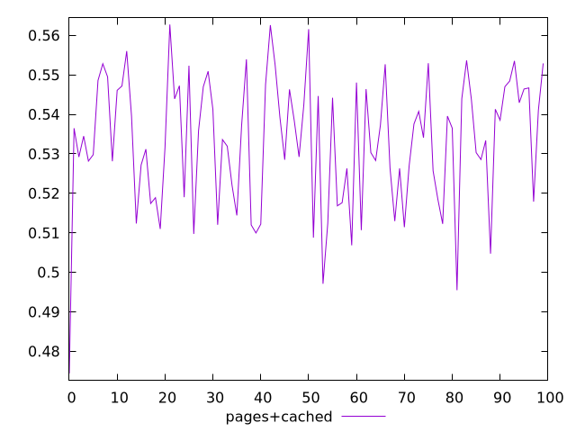
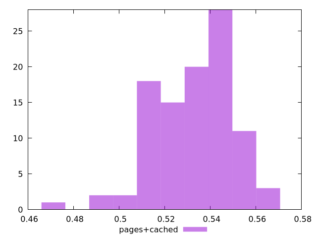

# Report pages+cached

[parent..](./..)  


## Scores

  

## Score Histogram

  

## Score Indicators

```yaml
min: 0.47440371886655186
max: 0.5627400818883896
range: 0.08833636302183778
mean: 0.532884679460863
median: 0.5351756415158513
stdev: 0.016566070699558295
skewness: -0.6118644185087165

```

## Raw Values

  

## Raw Values Histogram

  

## Raw Indicators

```yaml
{}

```

<style>
  img {
    max-width: 80%;
  }
</style>
      
