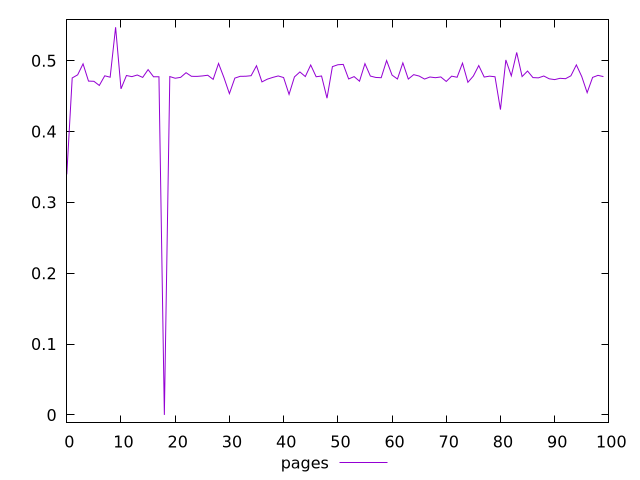
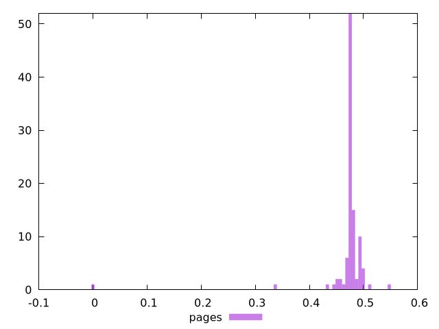

# Report pages

[parent..](./..)  


## Scores

  

## Score Histogram

  

## Score Indicators

```yaml
min: 0
max: 0.5471166192222592
range: 0.5471166192222592
mean: 0.4726418848484402
median: 0.4774558740056944
stdev: 0.051115745754147866
skewness: -8.041380836697462

```

## Raw Values

  

## Raw Values Histogram

  

## Raw Indicators

```yaml
{}

```

<style>
  img {
    max-width: 80%;
  }
</style>
      
