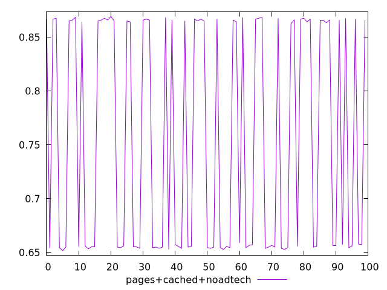
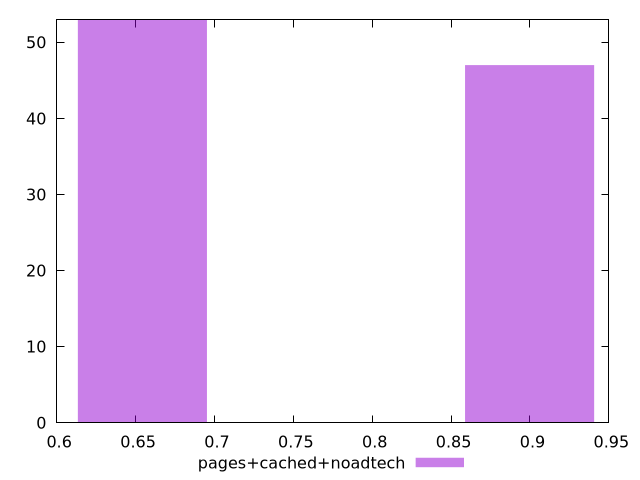
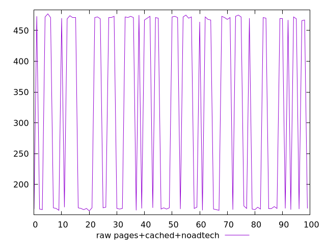
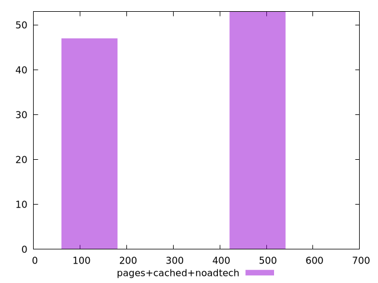

# Report pages+cached+noadtech

[parent..](./..)  


## Scores

  

## Score Histogram

  

## Score Indicators

```yaml
min: 0.6516666666666666
max: 0.8691666666666666
range: 0.21750000000000003
mean: 0.7542583333333336
median: 0.6572222222222223
stdev: 0.10534574217080878
skewness: 0.12019828903527216

```

## Raw Values

  

## Raw Values Histogram

  

## Raw Indicators

```yaml
min: 157
max: 477
range: 320
mean: 325.08
median: 467
stdev: 154.84835678818163
skewness: -0.1199880211819096

```

<style>
  img {
    max-width: 80%;
  }
</style>
      
