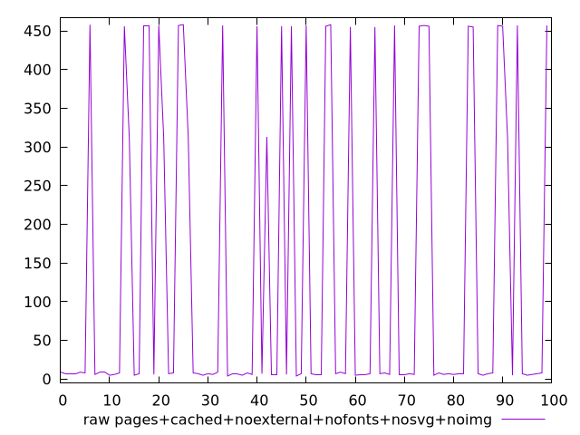

# Report pages+cached+noexternal+nofonts+nosvg+noimg

[parent..](./..)  


## Scores

  

## Score Histogram

  

## Score Indicators

```yaml
min: 0.6622222222222223
max: 0.9966666666666667
range: 0.33444444444444443
mean: 0.8957250000000007
median: 0.9941666666666666
stdev: 0.14817966913222547
skewness: -0.8566327530295945

```

## Raw Values

  

## Raw Values Histogram

  

## Raw Indicators

```yaml
min: 4
max: 458
range: 454
mean: 138.89
median: 7
stdev: 199.45329754105344
skewness: 0.8811856763995226

```

<style>
  img {
    max-width: 80%;
  }
</style>
      
