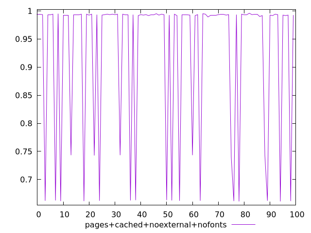
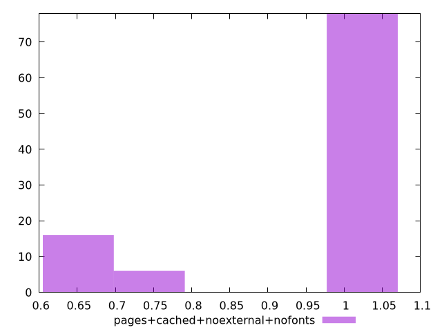
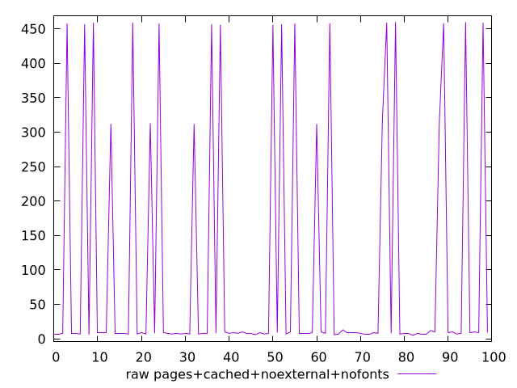
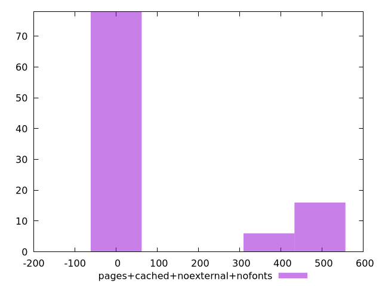

# Report pages+cached+noexternal+nofonts

[parent..](./..)  


## Scores

  

## Score Histogram

  

## Score Indicators

```yaml
min: 0.6611111111111111
max: 0.9958333333333333
range: 0.33472222222222225
mean: 0.9252055555555565
median: 0.9933333333333333
stdev: 0.12913985157739694
skewness: -1.4074928397581643

```

## Raw Values

  

## Raw Values Histogram

  

## Raw Indicators

```yaml
min: 5
max: 460
range: 455
mean: 98.45
median: 8
stdev: 172.69414437090802
skewness: 1.4488564045232948

```

<style>
  img {
    max-width: 80%;
  }
</style>
      
