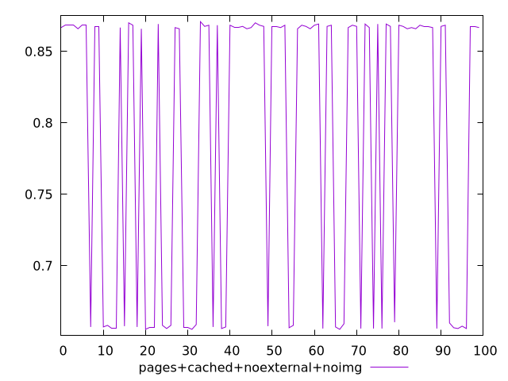
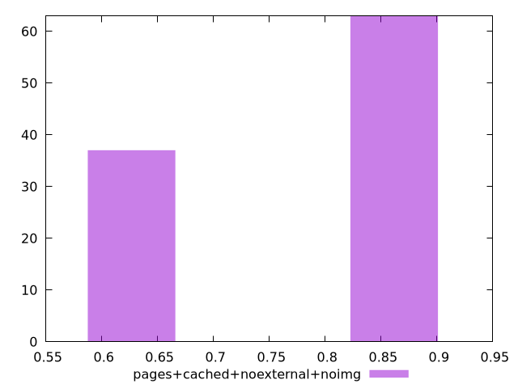
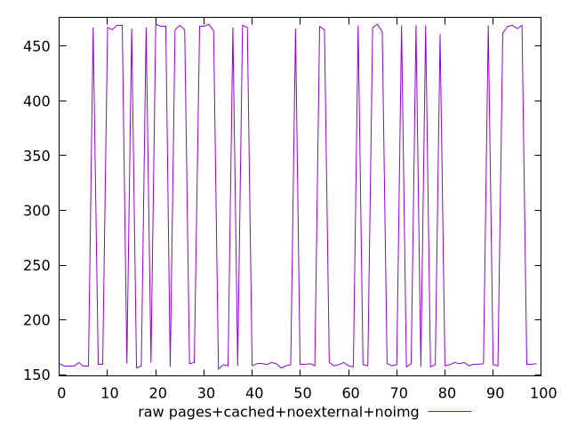
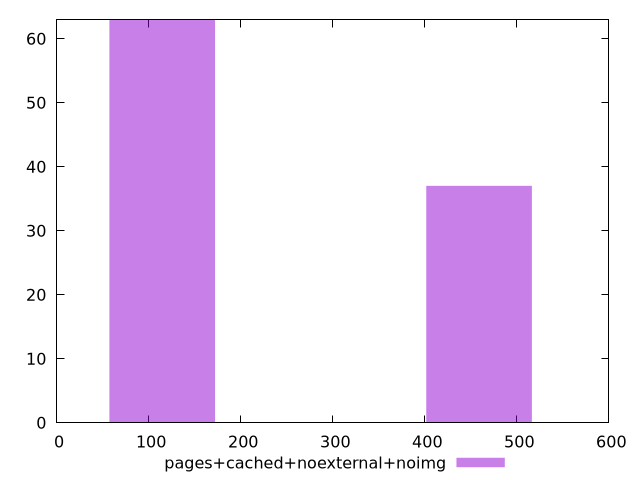

# Report pages+cached+noexternal+noimg

[parent..](./..)  


## Scores

  

## Score Histogram

  

## Score Indicators

```yaml
min: 0.6555555555555556
max: 0.8708333333333333
range: 0.2152777777777778
mean: 0.7897361111111114
median: 0.8666666666666667
stdev: 0.10165151962907999
skewness: -0.5384479447279555

```

## Raw Values

  

## Raw Values Histogram

  

## Raw Indicators

```yaml
min: 155
max: 470
range: 315
mean: 272.94
median: 160
stdev: 148.89464866139411
skewness: 0.5386113698312361

```

<style>
  img {
    max-width: 80%;
  }
</style>
      
