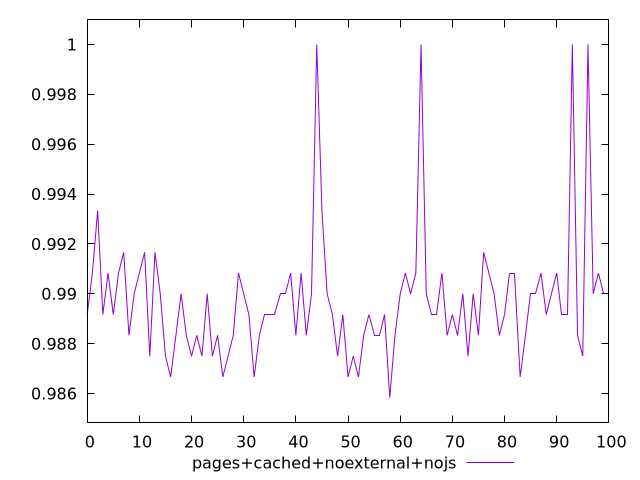
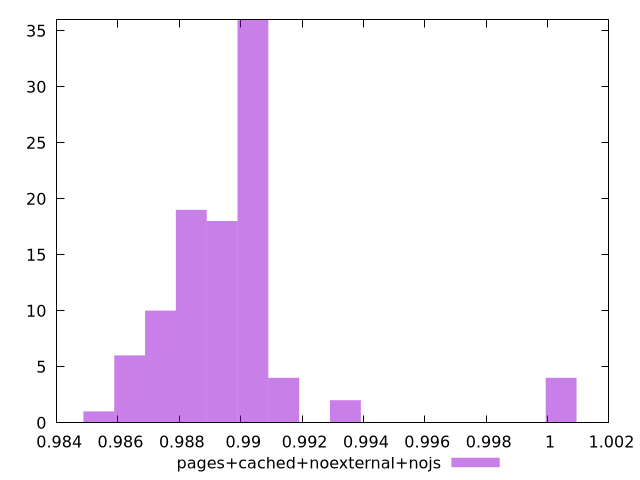
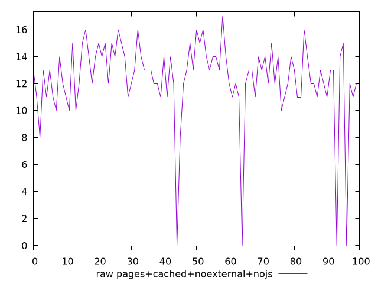
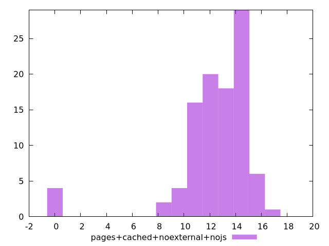

# Report pages+cached+noexternal+nojs

[parent..](./..)  


## Scores

  

## Score Histogram

  

## Score Indicators

```yaml
min: 0.9858333333333333
max: 1
range: 0.01416666666666666
mean: 0.9897083333333322
median: 0.9891666666666666
stdev: 0.0025450796756792435
skewness: 2.500317967877307

```

## Raw Values

  

## Raw Values Histogram

  

## Raw Indicators

```yaml
min: 0
max: 17
range: 17
mean: 12.35
median: 13
stdev: 3.05409561081509
skewness: -2.5003179678759655

```

<style>
  img {
    max-width: 80%;
  }
</style>
      
