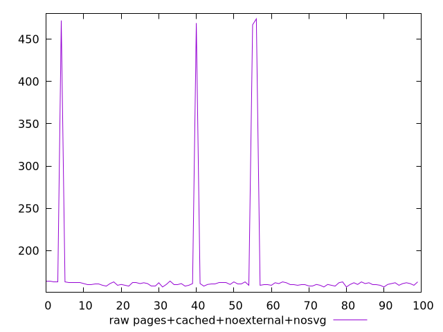

# Report pages+cached+noexternal+nosvg

[parent..](./..)  


## Scores

  

## Score Histogram

  

## Score Indicators

```yaml
min: 0.6533333333333333
max: 0.8691666666666666
range: 0.21583333333333332
mean: 0.8577694444444441
median: 0.8658333333333333
stdev: 0.041358349191420916
skewness: -4.686436166692176

```

## Raw Values

  

## Raw Values Histogram

  

## Raw Indicators

```yaml
min: 157
max: 474
range: 317
mean: 172.95
median: 161
stdev: 60.762879293200065
skewness: 4.689572502722004

```

<style>
  img {
    max-width: 80%;
  }
</style>
      
