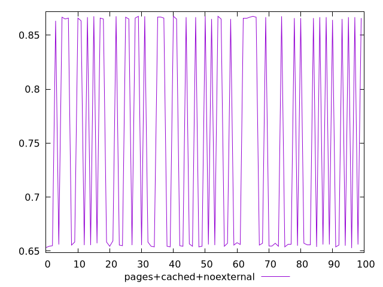
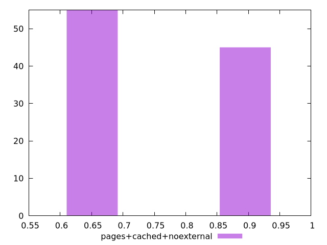
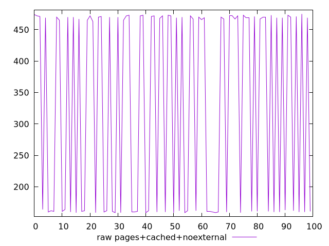
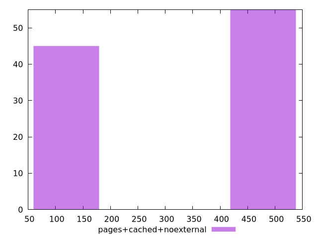

# Report pages+cached+noexternal

[parent..](./..)  


## Scores

  

## Score Histogram

  

## Score Indicators

```yaml
min: 0.6527777777777778
max: 0.8674999999999999
range: 0.21472222222222215
mean: 0.7502972222222221
median: 0.6575
stdev: 0.10478183725345663
skewness: 0.20086088286857975

```

## Raw Values

  

## Raw Values Histogram

  

## Raw Indicators

```yaml
min: 159
max: 475
range: 316
mean: 330.82
median: 466.5
stdev: 153.94306609912638
skewness: -0.20066980947750726

```

<style>
  img {
    max-width: 80%;
  }
</style>
      
