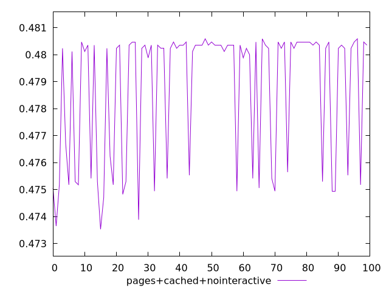
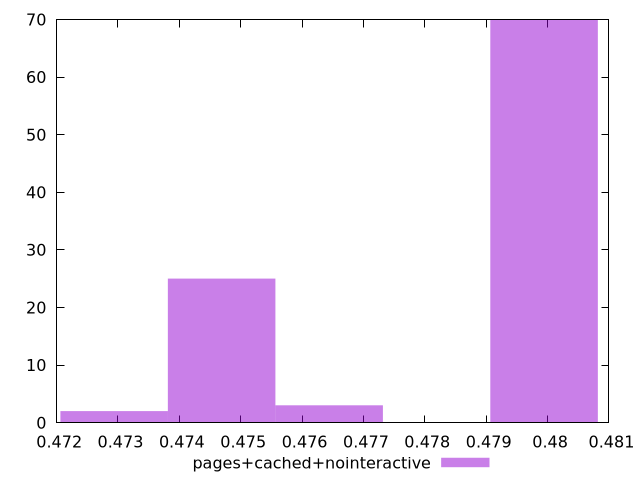
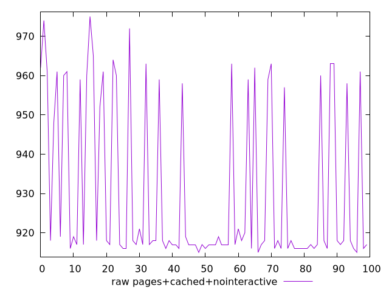
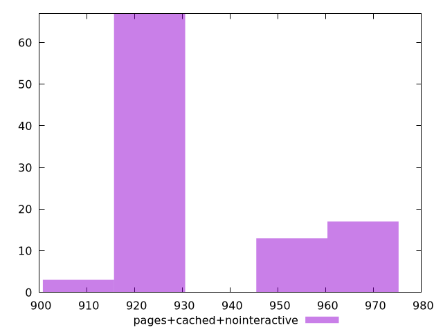

# Report pages+cached+nointeractive

[parent..](./..)  


## Scores

  

## Score Histogram

  

## Score Indicators

```yaml
min: 0.47352941176470587
max: 0.48058823529411765
range: 0.007058823529411784
mean: 0.4787729411764707
median: 0.48023529411764704
stdev: 0.0024147330370329506
skewness: -0.9314302080630631

```

## Raw Values

  

## Raw Values Histogram

  

## Raw Indicators

```yaml
min: 915
max: 975
range: 60
mean: 930.43
median: 918
stdev: 20.52523081478014
skewness: 0.9314302080629493

```

<style>
  img {
    max-width: 80%;
  }
</style>
      
