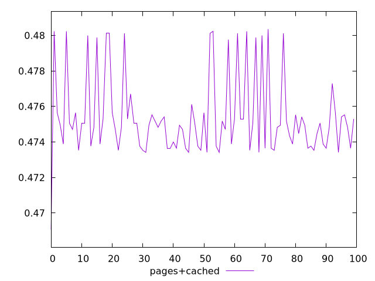
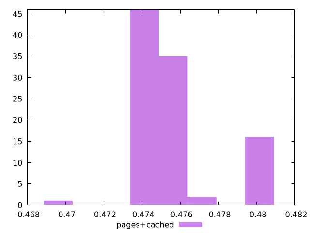
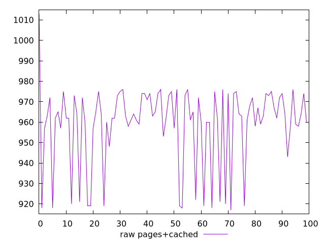
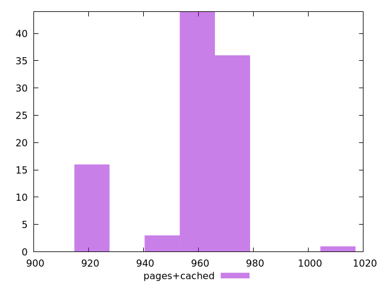

# Report pages+cached

[parent..](./..)  


## Scores

  

## Score Histogram

  

## Score Indicators

```yaml
min: 0.46905882352941175
max: 0.4803529411764706
range: 0.011294117647058843
mean: 0.4754070588235293
median: 0.47494117647058826
stdev: 0.0022610234385382596
skewness: 1.051705363853943

```

## Raw Values

  

## Raw Values Histogram

  

## Raw Indicators

```yaml
min: 917
max: 1013
range: 96
mean: 959.04
median: 963
stdev: 19.218699227575215
skewness: -1.051705363853785

```

<style>
  img {
    max-width: 80%;
  }
</style>
      
