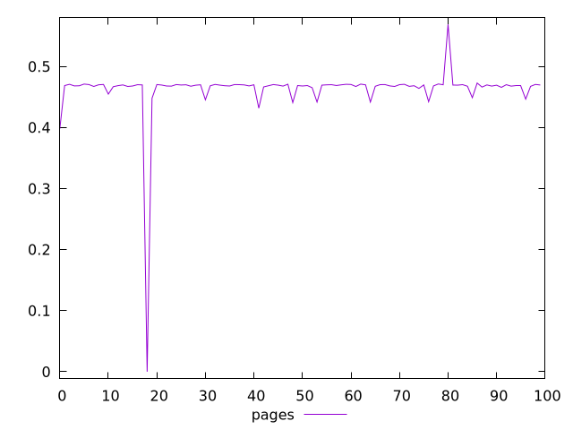
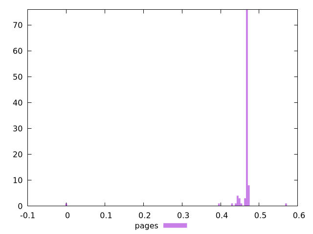
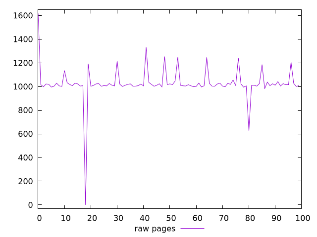
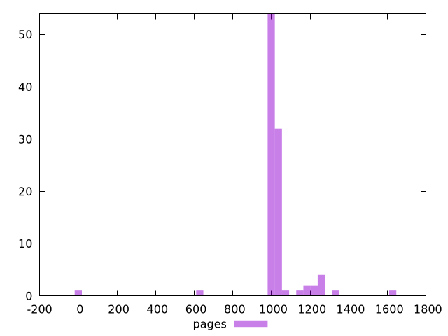

# Report pages

[parent..](./..)  


## Scores

  

## Score Histogram

  

## Score Indicators

```yaml
min: 0
max: 0.5688888888888889
range: 0.5688888888888889
mean: 0.46217006535947724
median: 0.4688235294117647
stdev: 0.04868511667935362
skewness: -8.476435366890941

```

## Raw Values

  

## Raw Values Histogram

  

## Raw Indicators

```yaml
min: 0
max: 1617
range: 1617
mean: 1026.17
median: 1013
stdev: 141.78251337876614
skewness: -2.9671941423684016

```

<style>
  img {
    max-width: 80%;
  }
</style>
      
