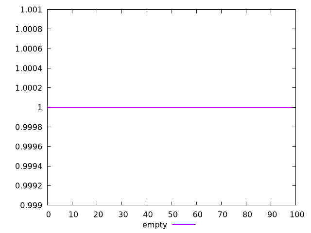
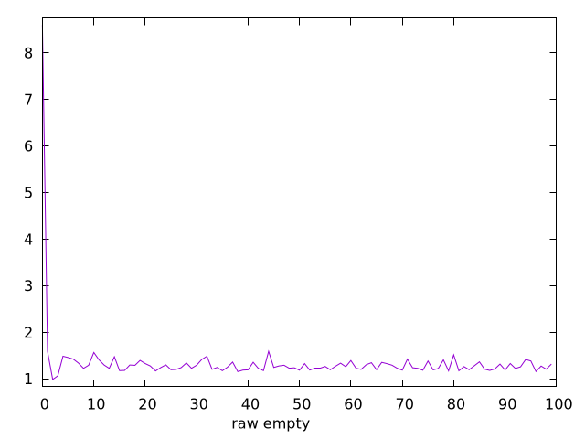
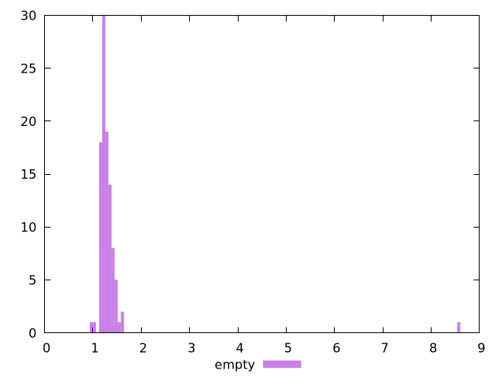

# Report empty

[parent..](./..)  


## Scores

  

## Score Histogram

  

## Score Indicators

```yaml
min: 1
max: 1
range: 0
mean: 1
median: 1
stdev: 0
skewness: .nan

```

## Raw Values

  

## Raw Values Histogram

  

## Raw Indicators

```yaml
min: 0.984
max: 8.599999999999994
range: 7.615999999999994
mean: 1.35081
median: 1.2565
stdev: 0.7362272298006908
skewness: 9.541292996520504

```

<style>
  img {
    max-width: 80%;
  }
</style>
      
