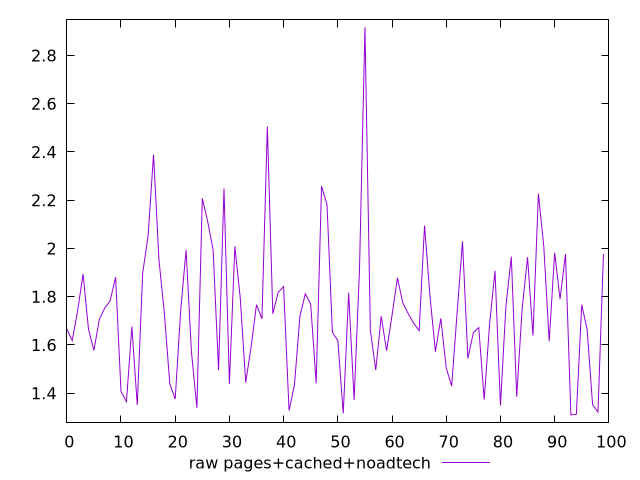

# Report pages+cached+noadtech

[parent..](./..)  


## Scores

  

## Score Histogram

  

## Score Indicators

```yaml
min: 1
max: 1
range: 0
mean: 1
median: 1
stdev: 0
skewness: .nan

```

## Raw Values

  

## Raw Values Histogram

  

## Raw Indicators

```yaml
min: 1.3099999999999998
max: 2.9170000000000003
range: 1.6070000000000004
mean: 1.7354699999999994
median: 1.7215000000000003
stdev: 0.2844615072377983
skewness: 0.9595178087886441

```

<style>
  img {
    max-width: 80%;
  }
</style>
      
