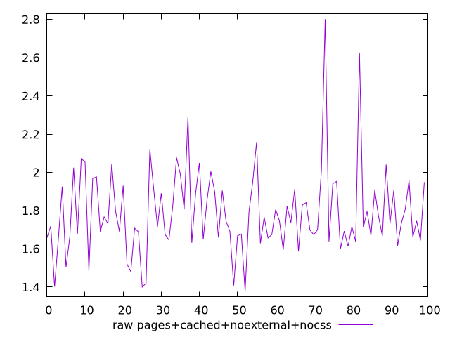
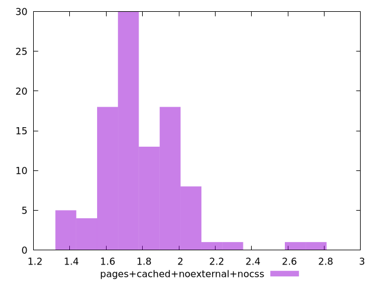

# Report pages+cached+noexternal+nocss

[parent..](./..)  


## Scores

  

## Score Histogram

  

## Score Indicators

```yaml
min: 1
max: 1
range: 0
mean: 1
median: 1
stdev: 0
skewness: .nan

```

## Raw Values

  

## Raw Values Histogram

  

## Raw Indicators

```yaml
min: 1.378
max: 2.802
range: 1.4240000000000002
mean: 1.7885099999999996
median: 1.737
stdev: 0.22235051135538234
skewness: 1.4257746596867158

```

<style>
  img {
    max-width: 80%;
  }
</style>
      
