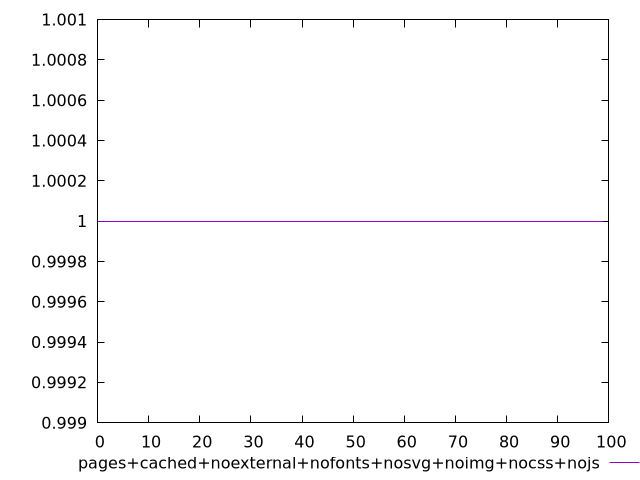
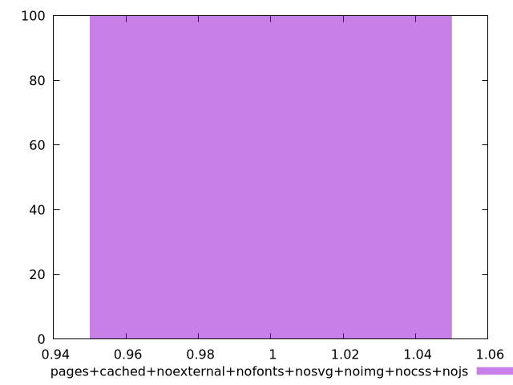

# Report pages+cached+noexternal+nofonts+nosvg+noimg+nocss+nojs

[parent..](./..)  


## Scores

  

## Score Histogram

  

## Score Indicators

```yaml
min: 1
max: 1
range: 0
mean: 1
median: 1
stdev: 0
skewness: .nan

```

## Raw Values

  

## Raw Values Histogram

  

## Raw Indicators

```yaml
min: 1.278
max: 2.525
range: 1.2469999999999999
mean: 1.5737400000000001
median: 1.5105
stdev: 0.2466514390795237
skewness: 1.3129267203837318

```

<style>
  img {
    max-width: 80%;
  }
</style>
      
