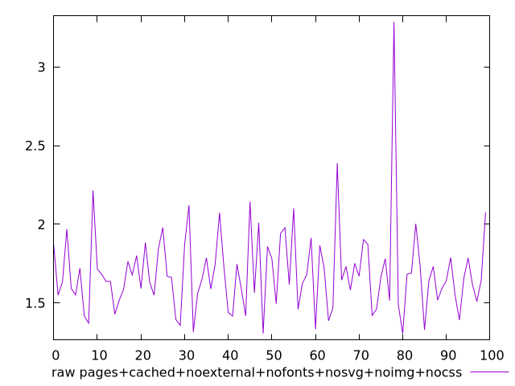
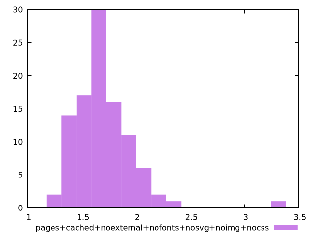

# Report pages+cached+noexternal+nofonts+nosvg+noimg+nocss

[parent..](./..)  


## Scores

  

## Score Histogram

  

## Score Indicators

```yaml
min: 1
max: 1
range: 0
mean: 1
median: 1
stdev: 0
skewness: .nan

```

## Raw Values

  

## Raw Values Histogram

  

## Raw Indicators

```yaml
min: 1.305
max: 3.286
range: 1.981
mean: 1.6925299999999999
median: 1.654
stdev: 0.2692634938122879
skewness: 2.2796980464439947

```

<style>
  img {
    max-width: 80%;
  }
</style>
      
