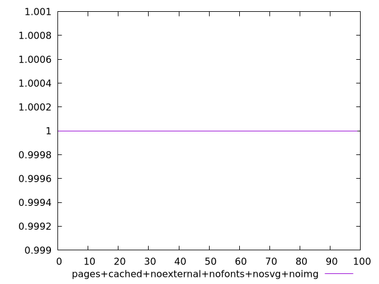

# Report pages+cached+noexternal+nofonts+nosvg+noimg

[parent..](./..)  


## Scores

  

## Score Histogram

  

## Score Indicators

```yaml
min: 1
max: 1
range: 0
mean: 1
median: 1
stdev: 0
skewness: .nan

```

## Raw Values

  

## Raw Values Histogram

  

## Raw Indicators

```yaml
min: 1.334
max: 2.822
range: 1.488
mean: 1.75057
median: 1.702
stdev: 0.2735433148515971
skewness: 1.0417832222170433

```

<style>
  img {
    max-width: 80%;
  }
</style>
      
