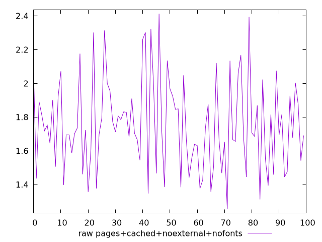

# Report pages+cached+noexternal+nofonts

[parent..](./..)  


## Scores

  

## Score Histogram

  

## Score Indicators

```yaml
min: 1
max: 1
range: 0
mean: 1
median: 1
stdev: 0
skewness: .nan

```

## Raw Values

  

## Raw Values Histogram

  

## Raw Indicators

```yaml
min: 1.254
max: 2.413
range: 1.1589999999999998
mean: 1.7549300000000003
median: 1.7094999999999998
stdev: 0.2702928876237775
skewness: 0.42878040709866994

```

<style>
  img {
    max-width: 80%;
  }
</style>
      
