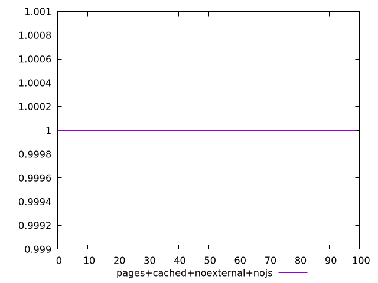
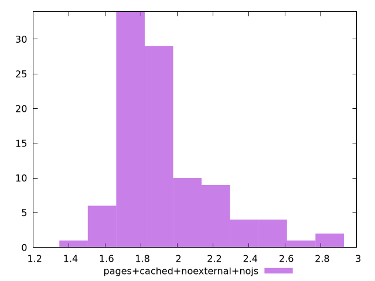

# Report pages+cached+noexternal+nojs

[parent..](./..)  


## Scores

  

## Score Histogram

  

## Score Indicators

```yaml
min: 1
max: 1
range: 0
mean: 1
median: 1
stdev: 0
skewness: .nan

```

## Raw Values

  

## Raw Values Histogram

  

## Raw Indicators

```yaml
min: 1.467
max: 2.883
range: 1.416
mean: 1.9347999999999996
median: 1.8515000000000001
stdev: 0.2685230343936997
skewness: 1.3339643539902846

```

<style>
  img {
    max-width: 80%;
  }
</style>
      
