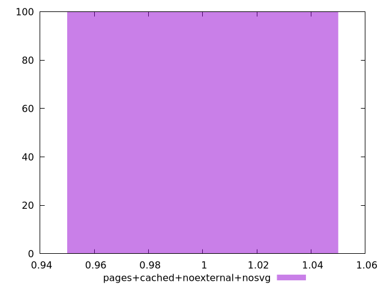
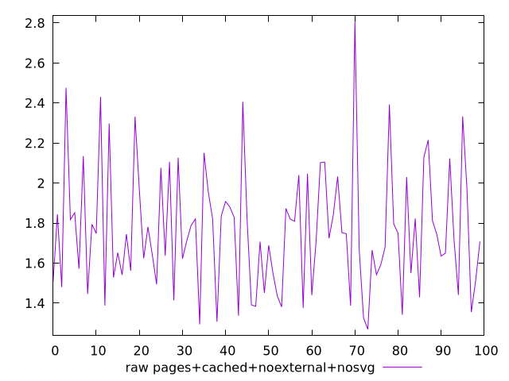
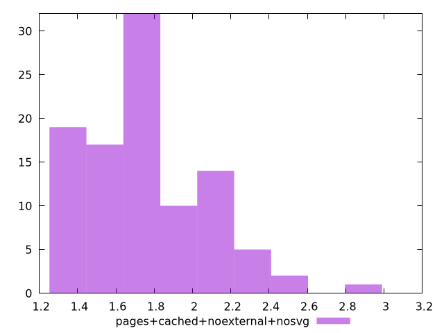

# Report pages+cached+noexternal+nosvg

[parent..](./..)  


## Scores

  

## Score Histogram

  

## Score Indicators

```yaml
min: 1
max: 1
range: 0
mean: 1
median: 1
stdev: 0
skewness: .nan

```

## Raw Values

  

## Raw Values Histogram

  

## Raw Indicators

```yaml
min: 1.269
max: 2.8070000000000004
range: 1.5380000000000005
mean: 1.7629899999999998
median: 1.7445
stdev: 0.30722003499120953
skewness: 0.7214489555954987

```

<style>
  img {
    max-width: 80%;
  }
</style>
      
