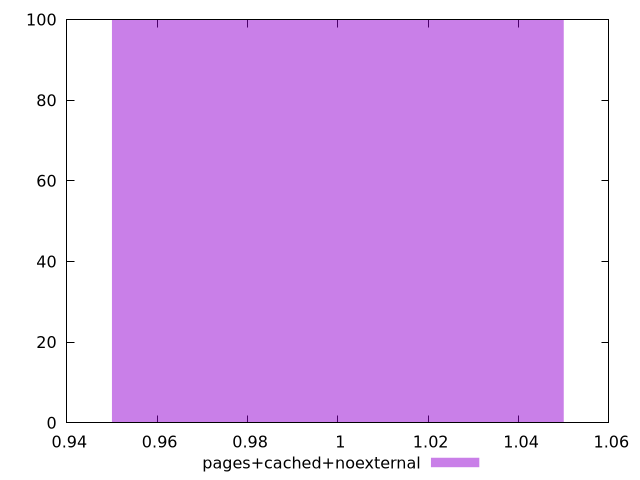
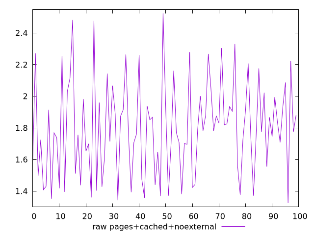
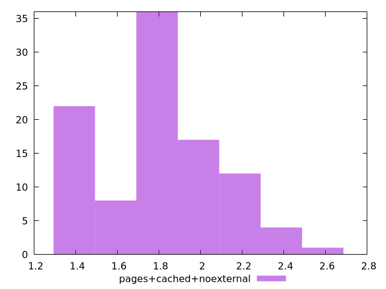

# Report pages+cached+noexternal

[parent..](./..)  


## Scores

  

## Score Histogram

  

## Score Indicators

```yaml
min: 1
max: 1
range: 0
mean: 1
median: 1
stdev: 0
skewness: .nan

```

## Raw Values

  

## Raw Values Histogram

  

## Raw Indicators

```yaml
min: 1.3239999999999998
max: 2.524
range: 1.2000000000000002
mean: 1.7966900000000001
median: 1.774
stdev: 0.29828948003575323
skewness: 0.3064490927217208

```

<style>
  img {
    max-width: 80%;
  }
</style>
      
