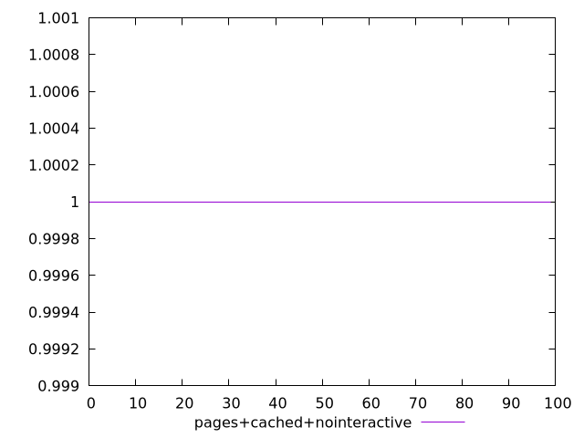
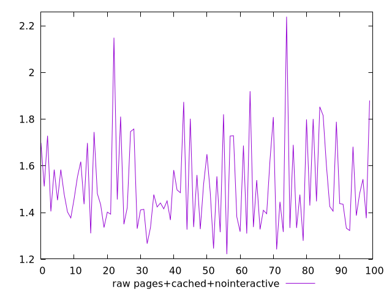
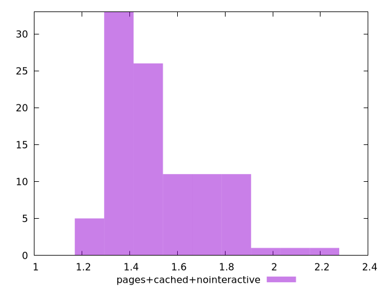

# Report pages+cached+nointeractive

[parent..](./..)  


## Scores

  

## Score Histogram

  

## Score Indicators

```yaml
min: 1
max: 1
range: 0
mean: 1
median: 1
stdev: 0
skewness: .nan

```

## Raw Values

  

## Raw Values Histogram

  

## Raw Indicators

```yaml
min: 1.222
max: 2.239
range: 1.017
mean: 1.5185500000000005
median: 1.4515
stdev: 0.19898147526842797
skewness: 1.0755460305519506

```

<style>
  img {
    max-width: 80%;
  }
</style>
      
