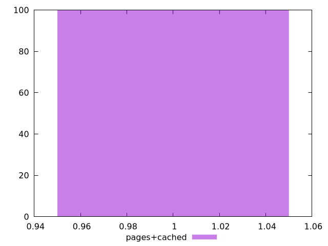
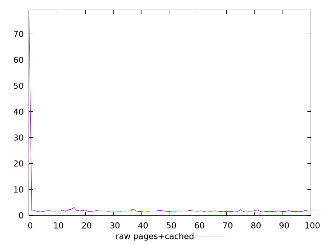
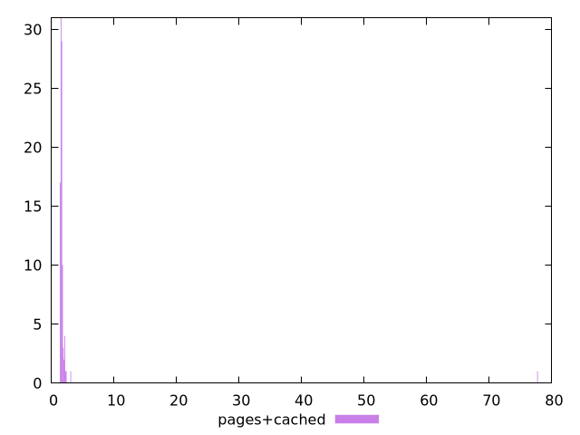

# Report pages+cached

[parent..](./..)  


## Scores

  

## Score Histogram

  

## Score Indicators

```yaml
min: 1
max: 1
range: 0
mean: 1
median: 1
stdev: 0
skewness: .nan

```

## Raw Values

  

## Raw Values Histogram

  

## Raw Indicators

```yaml
min: 1.384
max: 77.713
range: 76.329
mean: 2.43526
median: 1.631
stdev: 7.569377630452849
skewness: 9.83479930641634

```

<style>
  img {
    max-width: 80%;
  }
</style>
      
