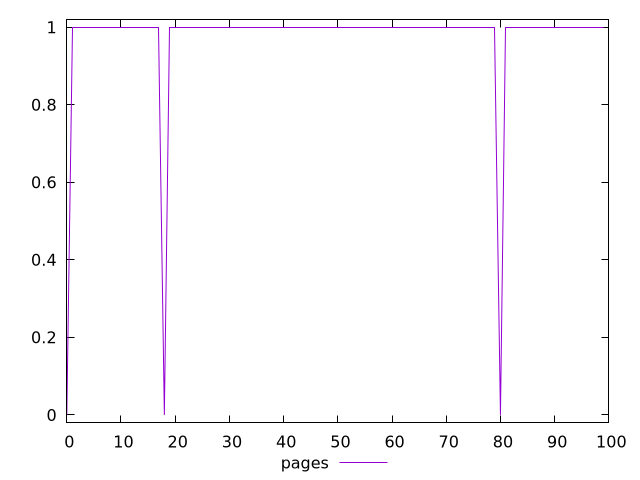
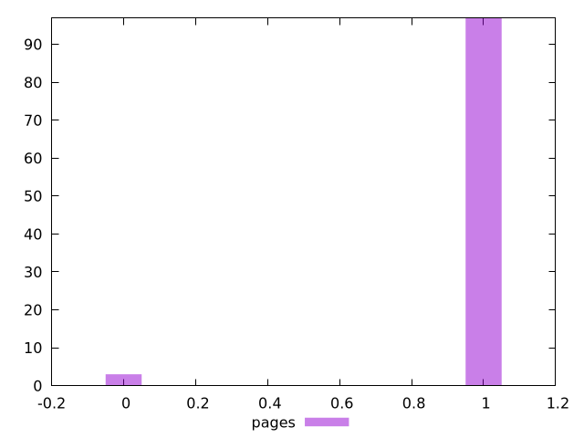
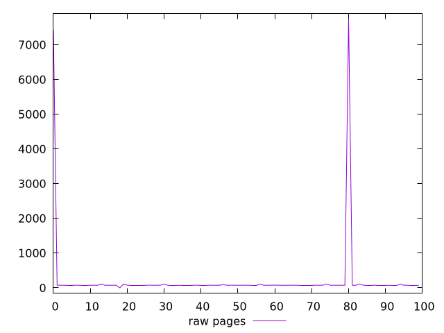
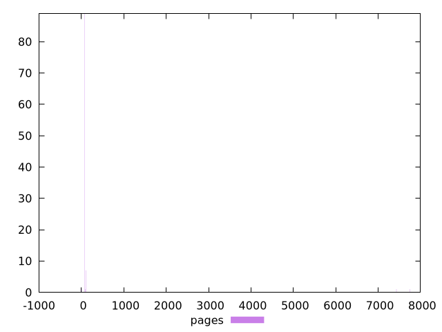

# Report pages

[parent..](./..)  


## Scores

  

## Score Histogram

  

## Score Indicators

```yaml
min: 0
max: 1
range: 1
mean: 0.97
median: 1
stdev: 0.17058722109231972
skewness: -5.510377588549179

```

## Raw Values

  

## Raw Values Histogram

  

## Raw Indicators

```yaml
min: 0
max: 7746.244
range: 7746.244
mean: 226.88318999999996
median: 74.91499999999999
stdev: 1051.861811813155
skewness: 6.860706367722894

```

<style>
  img {
    max-width: 80%;
  }
</style>
      
