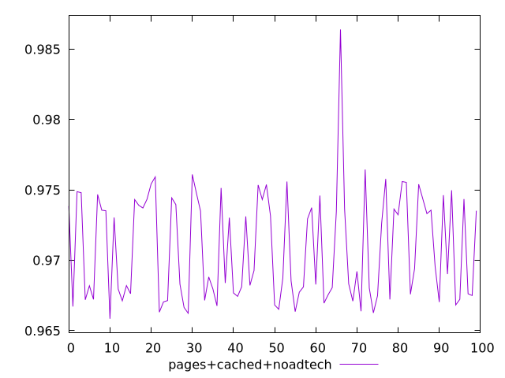

# Report pages+cached+noadtech

[parent..](./..)  


## Scores

  

## Score Histogram

  

## Score Indicators

```yaml
min: 0.9658455926839675
max: 0.9863988329433508
range: 0.02055324025938332
mean: 0.9708849630551525
median: 0.9692418956046196
stdev: 0.0037963541168571603
skewness: 0.6941081690465503

```

## Raw Values

  

## Raw Values Histogram

  

## Raw Indicators

```yaml
min: 2295.2199332753357
max: 2698.4958083420597
range: 403.275875066724
mean: 2616.3680129194636
median: 2646.0018813863276
stdev: 66.10256907322231
skewness: -1.156732165163537

```

<style>
  img {
    max-width: 80%;
  }
</style>
      
