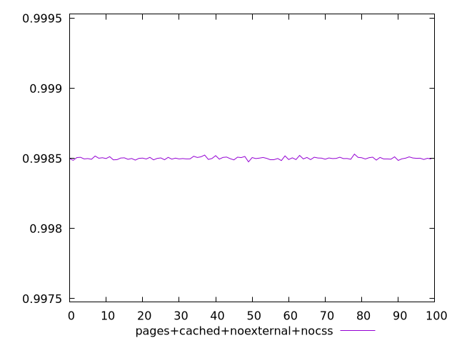
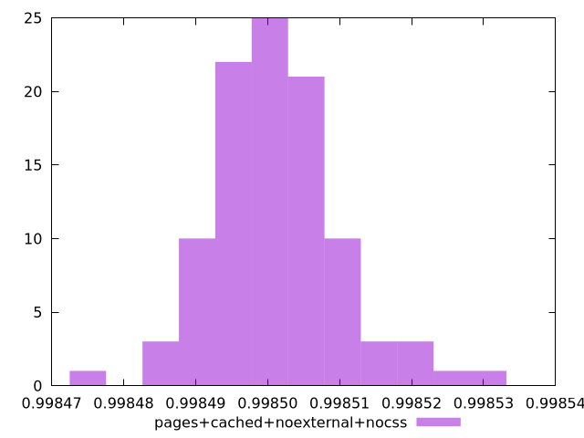
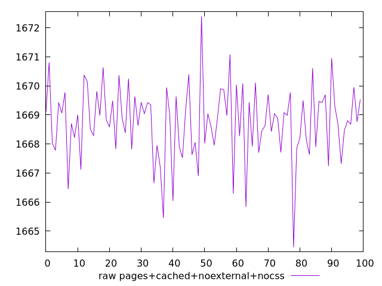
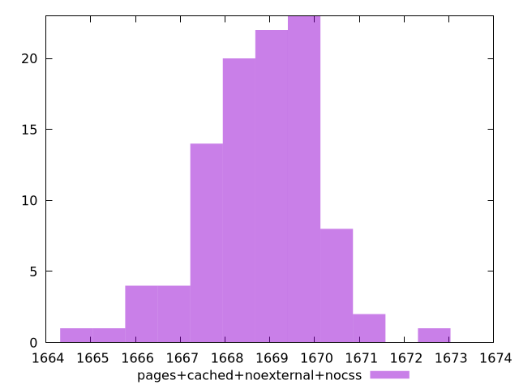

# Report pages+cached+noexternal+nocss

[parent..](./..)  


## Scores

  

## Score Histogram

  

## Score Indicators

```yaml
min: 0.9984756939575813
max: 0.9985310092383451
range: 0.00005531528076385683
mean: 0.9985012249726571
median: 0.9985003784031751
stdev: 0.000008830696129137636
skewness: 0.45584416822565893

```

## Raw Values

  

## Raw Values Histogram

  

## Raw Indicators

```yaml
min: 1664.4463999999998
max: 1672.4022
range: 7.955800000000181
mean: 1668.7558310000002
median: 1668.88035
stdev: 1.2699592138092377
skewness: -0.47539845852735463

```

<style>
  img {
    max-width: 80%;
  }
</style>
      
