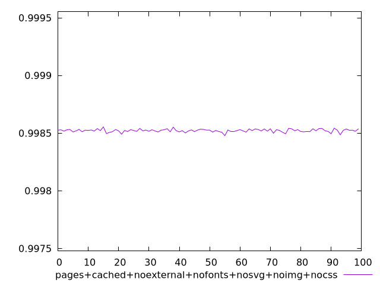
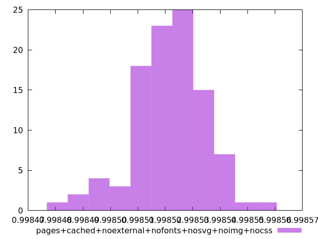
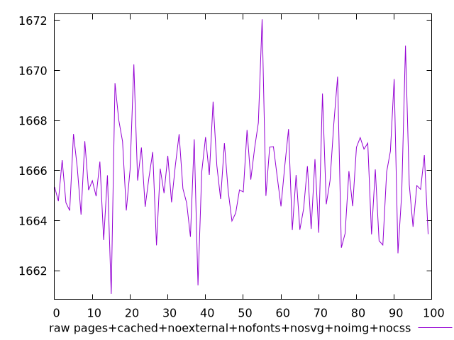
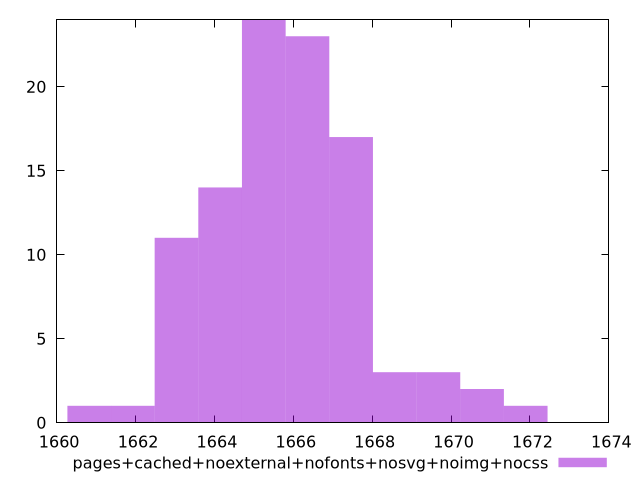

# Report pages+cached+noexternal+nofonts+nosvg+noimg+nocss

[parent..](./..)  


## Scores

  

## Score Histogram

  

## Score Indicators

```yaml
min: 0.9984781908150919
max: 0.9985539426913805
range: 0.00007575187628861002
mean: 0.9985217496171755
median: 0.998522120758475
stdev: 0.000013190407609131646
skewness: -0.5146641267075623

```

## Raw Values

  

## Raw Values Histogram

  

## Raw Indicators

```yaml
min: 1661.0789999999997
max: 1672.0479999999998
range: 10.969000000000051
mean: 1665.7876719999997
median: 1665.7404499999998
stdev: 1.9121723497676488
skewness: 0.4871656282795941

```

<style>
  img {
    max-width: 80%;
  }
</style>
      
