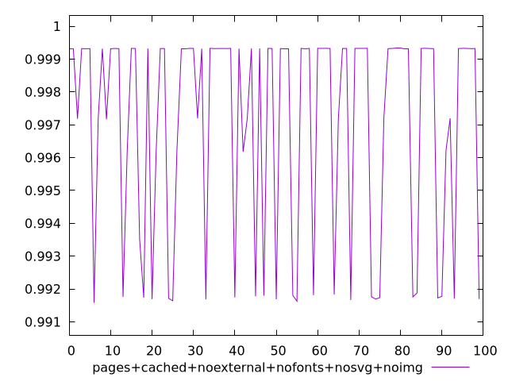
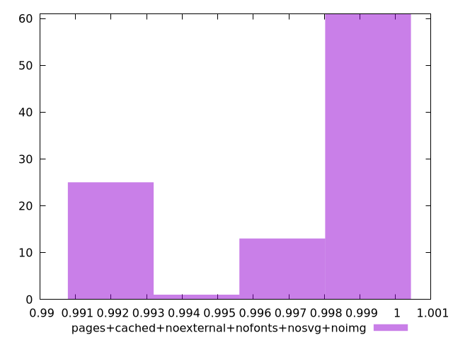

# Report pages+cached+noexternal+nofonts+nosvg+noimg

[parent..](./..)  


## Scores

  

## Score Histogram

  

## Score Indicators

```yaml
min: 0.9915826050605467
max: 0.9993287356576197
range: 0.007746130597072964
mean: 0.9970392281291965
median: 0.9993195632357846
stdev: 0.003223589944978258
skewness: -0.9147472076499062

```

## Raw Values

  

## Raw Values Histogram

  

## Raw Indicators

```yaml
min: 1509.6326000000001
max: 2126.6855499999997
range: 617.0529499999996
mean: 1712.263038
median: 1512.1102
stdev: 264.47824224117693
skewness: 0.6944969339797353

```

<style>
  img {
    max-width: 80%;
  }
</style>
      
