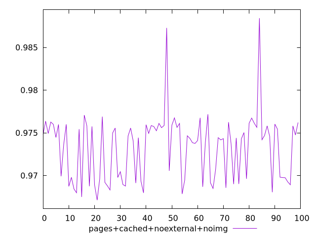
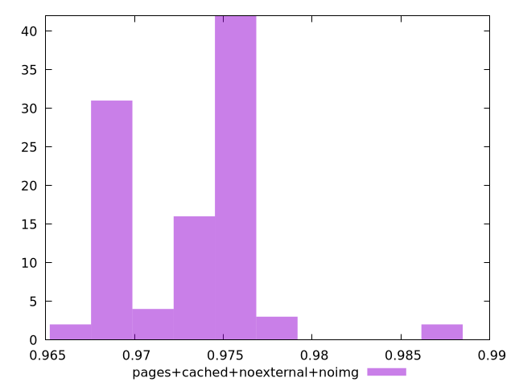
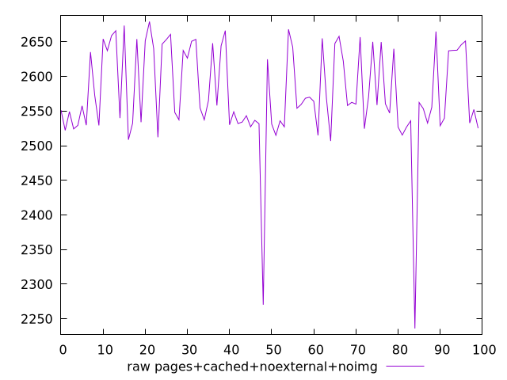
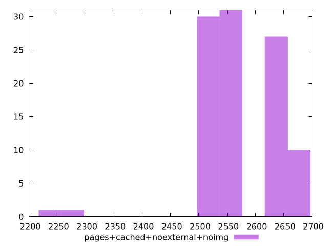

# Report pages+cached+noexternal+noimg

[parent..](./..)  


## Scores

  

## Score Histogram

  

## Score Indicators

```yaml
min: 0.9671231891537585
max: 0.9884193409477988
range: 0.02129615179404032
mean: 0.9732527738634603
median: 0.9744158509390555
stdev: 0.0037790733607724453
skewness: 0.7469872681214484

```

## Raw Values

  

## Raw Values Histogram

  

## Raw Indicators

```yaml
min: 2236.1090309959245
max: 2679.1570265867285
range: 443.047995590804
mean: 2575.5003825825656
median: 2558.306734248176
stdev: 71.06982163524876
skewness: -1.5481141645451861

```

<style>
  img {
    max-width: 80%;
  }
</style>
      
