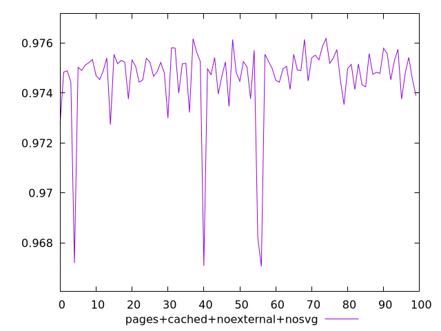
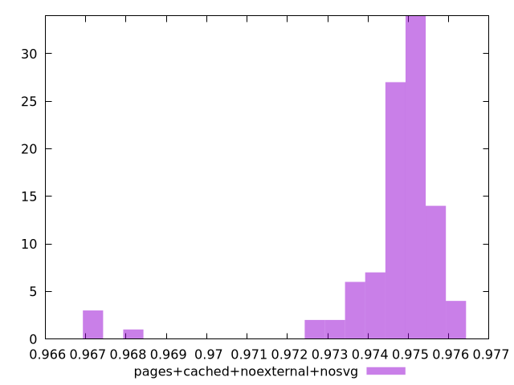
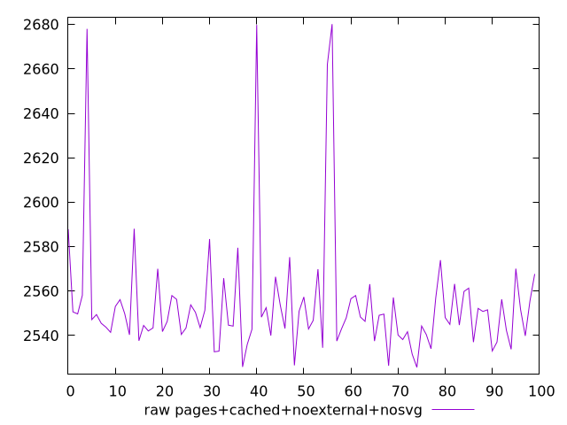
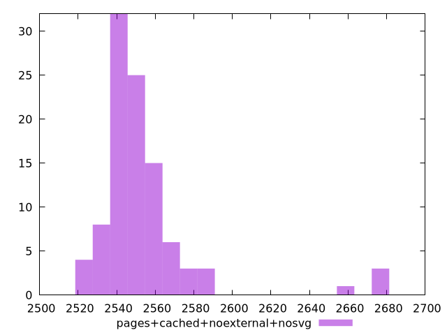

# Report pages+cached+noexternal+nosvg

[parent..](./..)  


## Scores

  

## Score Histogram

  

## Score Indicators

```yaml
min: 0.9670587276826366
max: 0.9761862787870952
range: 0.00912755110445862
mean: 0.974608357588789
median: 0.9749751988498045
stdev: 0.0016344057513549548
skewness: -3.451695001829155

```

## Raw Values

  

## Raw Values Histogram

  

## Raw Indicators

```yaml
min: 2525.6456319434433
max: 2680.144091321111
range: 154.4984593776676
mean: 2554.271105486394
median: 2548.153512338741
stdev: 27.765998918283827
skewness: 3.285451670637138

```

<style>
  img {
    max-width: 80%;
  }
</style>
      
