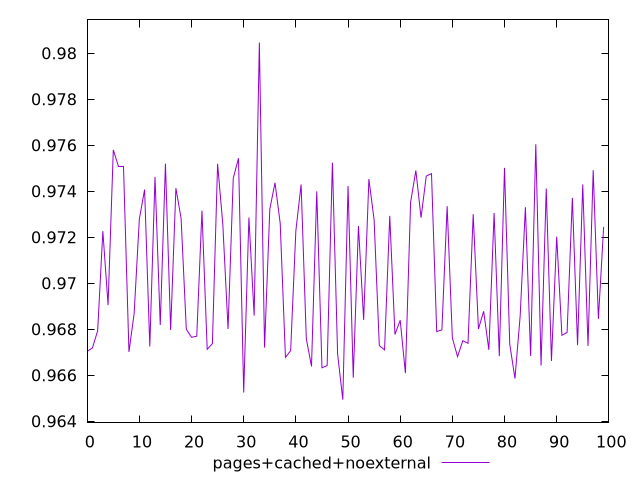
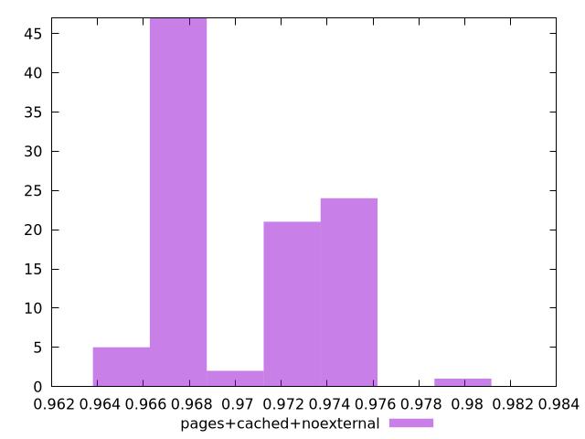
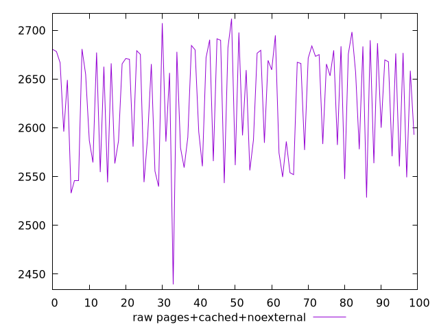
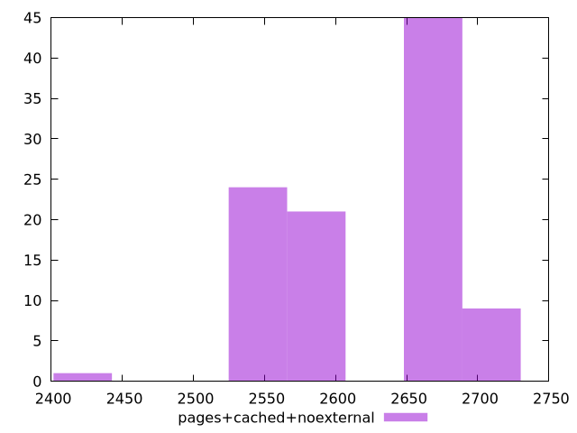

# Report pages+cached+noexternal

[parent..](./..)  


## Scores

  

## Score Histogram

  

## Score Indicators

```yaml
min: 0.9649366285574008
max: 0.9804632772631279
range: 0.015526648705727064
mean: 0.9704154183604753
median: 0.9685779569300628
stdev: 0.003521998125702708
skewness: 0.33818166163712093

```

## Raw Values

  

## Raw Values Histogram

  

## Raw Indicators

```yaml
min: 2439.443479418844
max: 2711.97739247568
range: 272.5339130568359
mean: 2624.706202035779
median: 2656.5447642375225
stdev: 58.85254975133141
skewness: -0.43773592374415776

```

<style>
  img {
    max-width: 80%;
  }
</style>
      
