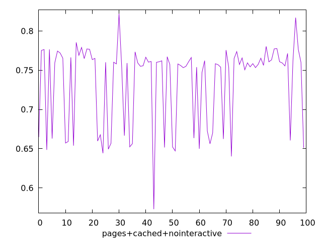
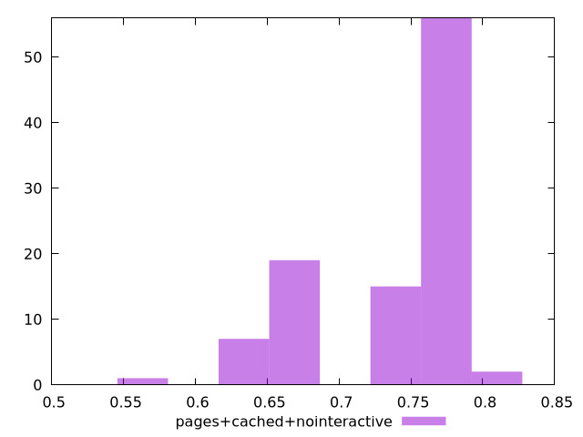
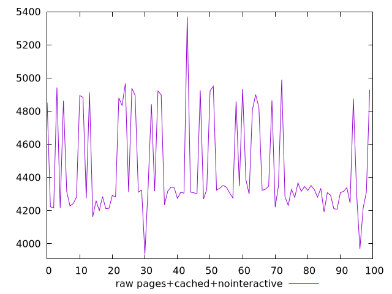
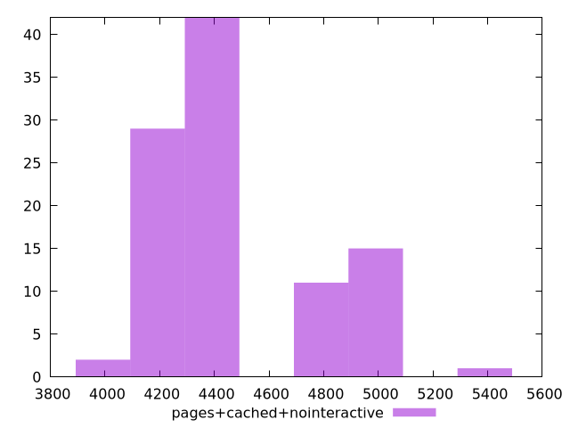

# Report pages+cached+nointeractive

[parent..](./..)  


## Scores

  

## Score Histogram

  

## Score Indicators

```yaml
min: 0.5728679746155902
max: 0.8220195281564561
range: 0.24915155354086582
mean: 0.7349883657017696
median: 0.758781340112036
stdev: 0.05138983891801859
skewness: -1.0142667045273719

```

## Raw Values

  

## Raw Values Histogram

  

## Raw Indicators

```yaml
min: 3936.942271881685
max: 5369.638317821304
range: 1432.6960459396187
mean: 4452.451839034996
median: 4319.071552595276
stdev: 291.9782935908827
skewness: 0.9929003812006988

```

<style>
  img {
    max-width: 80%;
  }
</style>
      
