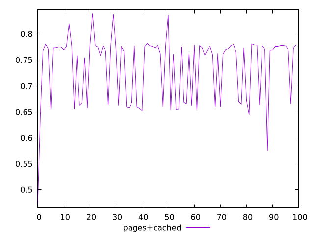
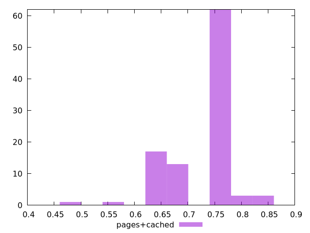
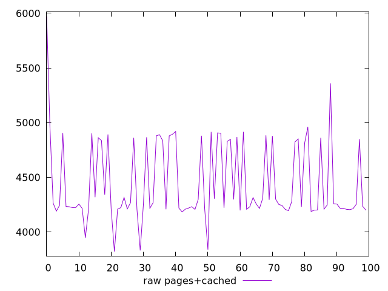
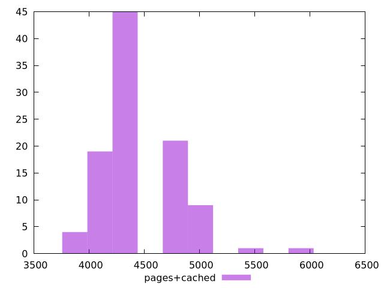

# Report pages+cached

[parent..](./..)  


## Scores

  

## Score Histogram

  

## Score Indicators

```yaml
min: 0.47249462133898923
max: 0.8398347157126117
range: 0.36734009437362247
mean: 0.7362522502799582
median: 0.7697566963795224
stdev: 0.06314940235468607
skewness: -1.1583650355982256

```

## Raw Values

  

## Raw Values Histogram

  

## Raw Indicators

```yaml
min: 3821.844476248242
max: 5970.435232042276
range: 2148.590755794034
mean: 4443.6547957525945
median: 4254.909910724834
stdev: 361.88306366298025
skewness: 1.1483938854009978

```

<style>
  img {
    max-width: 80%;
  }
</style>
      
